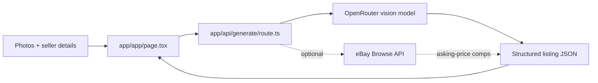

# Snaphaul 📸 · Snap a photo. Get a listing that sells.

[](https://github.com/aranlucas/snaphaul/actions/workflows/typecheck.yml)

Snaphaul turns one to five item photos into a marketplace-ready listing for
eBay, Etsy, Poshmark, or Mercari. It identifies the item, writes a
marketplace-specific title and description, suggests item specifics and tags,
and returns a price suggestion with a range. It is built for the reseller
whose inventory grows faster than they can write the 47th listing of the day.


> **The quick reseller loop:** drop in a few photos, choose a marketplace, add
> the flaw or measurement the camera cannot know, and copy the suggested title,
> details, and price range into your listing. You stay the editor; Snaphaul
> clears the blank page.

The public beta offers ten anonymous generations per browser session and does
not require an account. Treat the generated copy, category, condition, and
price as suggestions: the seller remains responsible for accuracy and each
marketplace's rules.

## Run locally

```bash
pnpm install
pnpm dev
```

Open [http://localhost:3000](http://localhost:3000). Build for production with
`pnpm build`.

The API route needs a server-side OpenRouter key. Copy it into your local
environment before generating a listing:

```bash
OPENROUTER_API_KEY=... pnpm dev
```

Supported settings:

| Variable | Required | Purpose |
| --- | --- | --- |
| `OPENROUTER_API_KEY` | yes | Vision model access for listing generation. |
| `OPENROUTER_MODEL` | no | Override the rotating free-model fallback list. |
| `EBAY_CLIENT_ID` / `EBAY_CLIENT_SECRET` | no | Enables live eBay Browse API asking-price comps. |
| `APP_URL` | no | Metadata base URL; defaults to the deployed app URL. |

Without eBay credentials the UI still shows the model's estimate. When enabled,
comps are asking prices from live listings, not sold-price evidence.

## Request flow



The browser compresses images before sending them as data URLs. The route
validates the marketplace, details, and one-to-five-image limit with Zod,
tries the configured model or free fallback models, and sets an HTTP-only
anonymous counter cookie. Photos and typed details are sent to OpenRouter for
generation; the application does not persist them. See the built-in
[privacy policy](app/privacy/page.tsx) and [terms](app/terms/page.tsx) for the
beta boundary.

## Source map

- `app/page.tsx` — public landing page and product explanation.
- `app/app/page.tsx` — uploader, marketplace selector, result cards, and copy
  actions.
- `app/api/generate/route.ts` — request validation, model fallback, free limit,
  cookies, and response schema.
- `lib/marketplaces.ts` — marketplace-specific title limits and prompt rules.
- `lib/ebay.ts` — optional eBay OAuth token cache and asking-price percentile
  calculation.
- `public/og.png` — the product's checked-in social preview image.

## Status and limits

Snaphaul is a free beta. It currently generates text and structured listing
fields; it does not publish listings to marketplaces, retain a listing history,
or provide guaranteed valuations. Free-model availability, image quality,
marketplace policy changes, and anonymous cookie clearing can all affect the
result.
