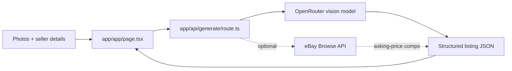

# Snaphaul 📸 · Snap a photo. Get a listing that sells.

[](https://github.com/aranlucas/snaphaul/actions/workflows/typecheck.yml)

Snaphaul turns one to five item photos into a marketplace-ready listing for
eBay, Etsy, Poshmark, or Mercari. It identifies the item, writes a
marketplace-specific title and description, suggests item specifics and tags,
and returns a price suggestion with a range. It is built for the reseller
whose inventory grows faster than they can write the 47th listing of the day.


> **The quick reseller loop:** drop in a few photos, choose a marketplace, add
> the flaw or measurement the camera cannot know, and copy the suggested title,
> details, and price range into your listing. You stay the editor; Snaphaul
> clears the blank page.

The public beta offers ten anonymous generations per browser session and does
not require an account. This cookie-based allowance is advisory: clearing or
changing cookies resets it, and concurrent requests can share a count. It is not
an enforceable per-person quota or abuse-protection mechanism. A hard budget
requires atomic server-owned persistence and an identity/renewal policy.
Treat the generated copy, category, condition, and
price as suggestions: the seller remains responsible for accuracy and each
marketplace's rules.

## Run locally

```bash
pnpm install
npm install -g portless@0.15.7 # requires Node.js 24+
pnpm dev
```

Open the URL printed by Portless (normally `https://snaphaul.localhost`). Build for production with
`pnpm build`.

The API route needs a server-side OpenRouter key. Copy it into your local
environment before generating a listing:

```bash
OPENROUTER_API_KEY=... pnpm dev
```

Supported settings:

| Variable                                | Required | Purpose                                              |
| --------------------------------------- | -------- | ---------------------------------------------------- |
| `OPENROUTER_API_KEY`                    | yes      | Vision model access for listing generation.          |
| `OPENROUTER_MODEL`                      | no       | Override the rotating free-model fallback list.      |
| `EBAY_CLIENT_ID` / `EBAY_CLIENT_SECRET` | no       | Enables live eBay Browse API asking-price comps.     |
| `APP_URL`                               | no       | Metadata base URL; defaults to the deployed app URL. |

Without eBay credentials the UI still shows the model's estimate. When enabled,
comps are asking prices from live listings, not sold-price evidence.


## Local URLs with Portless

The standard development command uses [Portless](https://github.com/vercel-labs/portless).
Install its pinned CLI once with Node.js 24 or newer, then run this repository's command after the
normal dependency and environment setup:

```sh
npm install -g portless@0.15.7
pnpm dev
```

The main checkout uses `https://snaphaul.localhost` with the default proxy settings.
Use the URL printed by Portless if you have changed its proxy port, TLS, or TLD.
Linked Git worktrees get a branch prefix, so each checkout has its own origin.
The first HTTPS run can request local administrator permission to bind port 443,
trust its development certificate, and synchronize local hostnames. Ctrl+C stops
the child server and removes its route.

Keep the existing server-side API keys in your local environment. `APP_URL` only
controls metadata; no callback or public deployment setting needs to change.

## Request flow



The browser compresses images before sending them as data URLs. The route
passes requests through `lib/generate-listing.ts`, which bounds the JSON body to
8 MiB, validates the marketplace/details and one-to-five-image limit, and checks
base64 encoding, MIME type, file signature, and a 1 MiB decoded limit per image.
JPEG, PNG, WebP, and GIF are supported; SVG and other media are rejected. File
signature checks are not a full pixel decode or malware scan. Invalid requests
return 400 (or 413 for oversized bodies) before any model call, without echoing
photo data. The module tries the configured model or free fallback models and
preserves a valid listing if optional comparisons fail. The route sets an HTTP-only
anonymous counter cookie. Photos and typed details are sent to OpenRouter for
generation; the application does not persist them. See the built-in
[privacy policy](app/privacy/page.tsx) and [terms](app/terms/page.tsx) for the
beta boundary.

## Source map

- `app/page.tsx` — public landing page and product explanation.
- `app/app/page.tsx` — uploader, marketplace selector, result cards, and copy
  actions.
- `app/api/generate/route.ts` — OpenRouter adapter, advisory allowance, cookies,
  and HTTP response mapping.
- `lib/generate-listing.ts` — bounded request/image validation, model fallback,
  optional comparisons, and typed generation outcomes.
- `lib/marketplaces.ts` — marketplace-specific title limits and prompt rules.
- `lib/ebay.ts` — optional eBay OAuth token cache and asking-price percentile
  calculation.
- `public/og.png` — the product's checked-in social preview image.

## Status and limits

Snaphaul is a free beta. It currently generates text and structured listing
fields; it does not publish listings to marketplaces, retain a listing history,
or provide guaranteed valuations. Free-model availability, image quality,
marketplace policy changes, and anonymous cookie clearing can all affect the
result.

## Offline checks

`pnpm test` compiles and runs the Node test suite with synthetic image data and
local model/comparison adapters. It makes no OpenRouter or eBay requests. CI also
runs these regressions. Run `pnpm typecheck`, `pnpm lint`, and `pnpm build` for the
remaining checks. Failed generation or invalid input does not update the cookie
allowance; only a successfully generated listing is counted.
